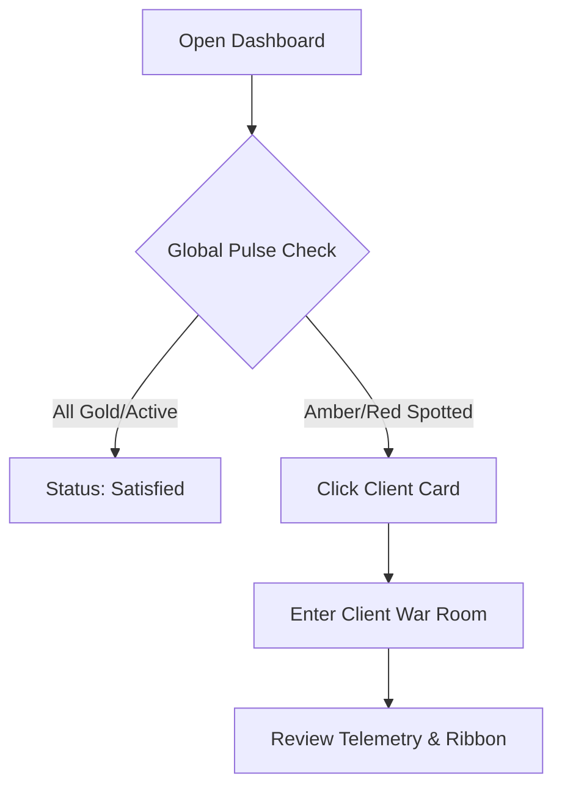
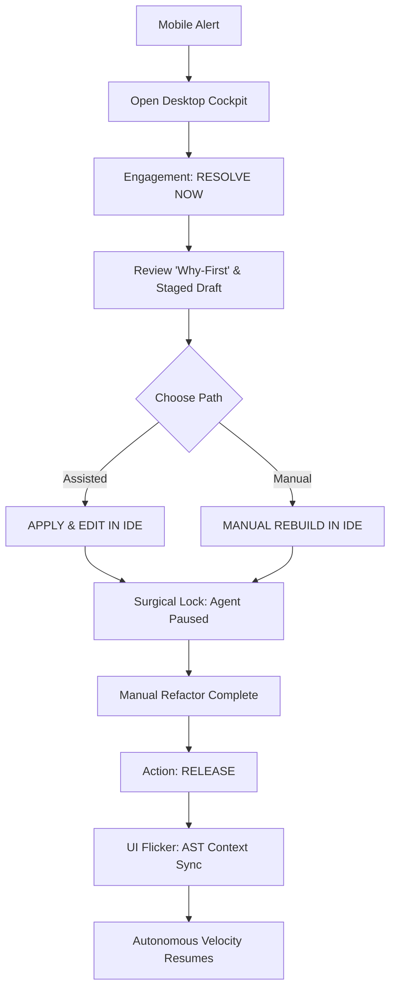
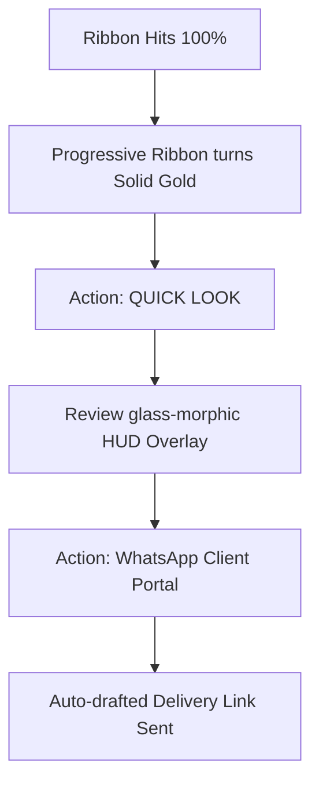

# UX Design Specification EngineAI Dashboard

**Author:** Wardo
**Date:** 2026-04-04

---

## Executive Summary

### Project Vision
The **EngineAI Dashboard** is the internal "Operational Nervous System" for Engine AI founders, Ben and Joe. It transforms business operations from manual founder-led tasks to autonomous orchestration via a "Digital Assembly Line" of specialized hierarchical agents. The focus is on providing an **"Executive Cockpit"** that enforces Total Managerial Transparency, eliminating operational blindness.

### Target Users
*   **Founders (Ben & Joe):** The primary "Conductors." They require high-level strategic oversight, glanceable "heartbeat" metrics, and the ability to perform surgical HITL (Human-In-The-Loop) interventions without manual refactoring overhead.
*   **ENGINE Agents (The Board):** Hierarchical "Digital Employees" (CEO, Managers, Specialists). They require a UI that reflects their structural governance, providing 100% visibility into their reasoning, thought loops, and execution states.

### Key Design Challenges
*   **Managerial Transparency:** Turning complex agent "thought loops" into meaningful, non-overwhelming managerial reports.
*   **Visible Delegation:** Representing 24h+ self-healing Vercel Workflows in a way that provides confidence without constant monitoring.
*   **Situation Room Utility:** Balancing a dense, data-rich "Military Situation Room" aesthetic for power-users with the premium "Luxury Concierge" brand identity (#0A0A0A / #C4A35A).

### Design Opportunities
*   **The Progressive Ribbon:** A horizontal assembly line visual that tracks project velocity from Discovery to Handoff in real-time.
*   **Surgical Deep-Links:** Instant "Portals" from the dashboard directly into editable areas (Antigravity IDE, GitHub, Google Docs) for immediate founder refactoring.
*   **Manual Override (Surgical Lock):** A protocol where agents step back completely during human intervention, resuming only after a manual "Release" and automated context sync.

## Project Understanding

### The "Executive HUD" Concept
The dashboard is designed as a high-leverage Heads-Up Display. The primary goal is **Glanceable Certainty**—allowing Joe and Ben to see the "pulse" of all active BIAB projects in under 5 seconds.

### Client War Room (Project Drill-Down)
Clicking a client (e.g., Jackson Construction) opens a dedicated "War Room" featuring:
*   **Identity Strip:** High-contrast basics (Name, Industry, Contacts).
*   **Progressive Ribbon:** A segmented horizontal track pulsing with Engine Gold, showing the project moving through lifecycle stages.
*   **Quick Look Portal:** Instant, in-dashboard previews of artifacts (PRDs, SoWs, Code) next to their respective ribbon stages.
*   **Omni-Channel Command Strip:** A persistent bar for one-touch communication (WhatsApp, Telegram, Email) and direct "Agent Interrogation" queries.

## Core User Experience

### Defining Experience
The core experience is **"The Master Orchestrator's Command."** The dashboard is a high-power desktop environment where Ben and Joe manage the digital assembly line. It provides high-fidelity oversight, allowing the founders to maintain a **"Surgical Command"** over multiple parallel builds, ensuring every output meets the Engine AI "Golden Template" standard.

### Platform Strategy
*   **Desktop-First Control:** The Web App is optimized for high-density desktop usage, providing the primary workspace for project management and intervention.
*   **Proactive Mobile Reporting:** Mobile interaction is primarily agent-driven through external messaging platforms (Telegram/WhatsApp). Agents push real-time alerts and "Pulse" updates to the founders' phones, triggering a move to the desktop cockpit when intervention is required.
*   **Local IDE Integration:** The platform is engineered for deep-linking into the Antigravity IDE and local file systems, making the boundary between the dashboard and the development environment invisible.

### Effortless Interactions
*   **Surgical Entry Points:** One-click transitions from any stage of the "Progressive Ribbon" to the source asset (IDE, GitHub, Doc) without manual navigation.
*   **Automated State-Lock:** The system automatically suspends agent processes during manual refactors, ensuring the human "Conductor" has absolute sovereignty over the build state.

### Critical Success Moments
*   **The "Push-to-Action" Trigger:** Receiving an agent-driven alert on mobile that leads to a successful, high-leverage refactor on desktop.
*   **The Zero-Touch Handoff:** Opening the dashboard to find a complex build has been 100% verified by internal quality gates and is ready for client delivery.

### Experience Principles
*   **High-Fidelity Control:** Prioritize utility and information density over "minimalist" SaaS aesthetics.
*   **Proactive Transparency:** Ensure agents "report up" through mobile channels to eliminate operational blindness.
*   **Surgical Precision:** Every dashboard element should be an actionable portal to a specific project asset.
*   **Founder Sovereignty:** The OS must pause and yield completely to human intervention until a manual "Release" is triggered.

## Desired Emotional Response

### Primary Emotional Goals
The primary emotional goal is **"Total Managerial Confidence."** The dashboard should evoke a sense of **Strategic Command**, where the founders feel like "Conductors" rather than "Cogs." The transition between autonomous agent execution and human intervention should feel empowering, providing the emotional relief that the "Digital Assembly Line" is functioning at an elite level.

### Emotional Journey Mapping
*   **Oversight (Start):** **Calm & Focus.** The "Global Pulse" matrix provides instant clarity, eliminating the anxiety of "operational blindness."
*   **Intervention (Middle):** **Confidence & Control.** The "Surgical Lock" and "Deep-Link Portals" ensure the founder feels like the absolute authority during high-stakes refactors.
*   **Completion (End):** **Strategic Satisfaction.** Seeing the 24-hour delivery timeline met with zero-touch quality builds the "flywheel of trust" in the autonomous system.

### Micro-Emotions
*   **Glanceable Trust:** Established through "Quick Look" previews that verify agent output quality in seconds.
*   **Flow Momentum:** Hitting "Release" after a manual edit creates a sense of seamless human-agent collaboration.
*   **Elite Professionalism:** The premium brand palette (#0A0A0A / #C4A35A) reinforces the "Business in a Box" as a high-margin, enterprise-grade product.

### Design Implications
*   **Visual Status Indicators:** Use the Engine Gold (#C4A35A) "pulse" to indicate active agent movement, providing a visual "heartbeat" for the agency.
*   **The "Manual Mode" Shift:** Dramatically change the UI state (e.g., ribbon color shift to "Control White") when a human intervenes to reinforce the feeling of absolute sovereignty.
*   **Minimalist High-Density:** Use clean, premium typography to present high volumes of data without causing cognitive load or "admin fatigue."

## Surgical Intervention & Decision HUD

### The "Surgical Lock" Protocol
To ensure 100% human sovereignty during refactors, the OS implements a **"Surgical Lock"** state. When a founder enters an editable area (IDE, GitHub, Doc), the Vercel Workflow hits a blocking pause, suspending all agent execution until a manual **"Release"** is triggered by the founder.

### The "RESOLVE NOW" Decision HUD
When a project hits a "Red" structural risk on the Progressive Ribbon, the founder is presented with a **"Strategic Decision Panel"** featuring:
*   **Why-First Managerial Summary:** A natural-language executive summary explaining the agent's logic and the cause of the bottleneck (e.g., *"The Jackson Construction SoW was missing the 'SkunkWorks' pricing tier..."*).
*   **In-Dash Draft Preview:** A "Shadow Stage" view showing the agent's proposed fix directly in the OS for instant verification without leaving the cockpit.
*   **Dual-Path Resolution:**
    1.  **[APPLY & EDIT IN IDE]:** Stages the agent's draft and deep-links the founder into the Antigravity IDE at the exact line of failure for a quick "Surgical Spike."
    2.  **[MANUAL REBUILD]:** Discards the agent's draft and opens a clean file in the IDE for 100% manual logic implementation.

### Handoff & Context Sync
Upon hitting **"Release,"** the agent performs a fresh **AST/Text Scan** of the founder's manual refactor to ingest the new "Golden Standard" before resuming the 24-hour delivery countdown. Silent **"Toast" notifications** provide instant, non-intrusive confirmation that the agent has successfully synchronized with the founder's changes.

## UX Pattern Analysis & Inspiration

### Inspiring Products Analysis
*   **Formula 1 App/HUD:** The primary aesthetic and functional inspiration for the EngineAI Dashboard. It masters **High-Performance Telemetry**, using high-contrast data visualization to provide split-second certainty. The "Cockpit" feel creates a sense of elite operational control, focusing on "Shift" data over administrative fluff.
*   **Linear:** For its speed, high-performance typography, and "Power-User" interactions. It proves that a "Master Orchestrator" doesn't need a mouse if the keyboard-shortcuts and command-palette interactions are deep enough.

### Transferable UX Patterns
*   **Telemetry Cards:** High-density, card-based layouts inspired by F1 steering wheel displays. Use large, bold numbers for "Heartbeat" metrics (e.g., "Build Velocity: +8.2%") and micro-sparklines for tracking the 24-hour delivery trend.
*   **The "HUD" Overlay:** Use glass-morphic, semi-transparent overlays for "Quick Look" previews, making them feel like a digital projection over the "War Room" rather than a traditional new page or modal.
*   **Glow-State Indicators:** Use thin, glowing borders and accents in Engine Gold (#C4A35A) to indicate active "Pulse" states and "Surgical Lock" status on the Progressive Ribbon.

### Anti-Patterns to Avoid
*   **"Classic Microsoft" UI:** Absolutely no legacy-style buttons, bevels, drop-shadows, or standard corporate-grey backgrounds. Avoid "Windows-style" nested menus and administrative friction.
*   **Operational Blindness:** No "loading spinners" without context. If a project is moving, the "Ribbon" must show the live telemetry of the agent's current action (e.g., "AST-Scanning Jackson.tsx...").
*   **Text-Heavy Admin:** Eliminate long paragraphs of "instructions" or "manuals." Focus on **Triggers, Portals, and Executive Summaries.**

### Design Inspiration Strategy
*   **Aesthetic:** **Ultra-Modern Tech Noir.** Dark carbon-fibre backgrounds (#0A0A0A) with crisp, premium typography (Inter / JetBrains Mono) and high-contrast Engine Gold (#C4A35A) accents.
*   **Interaction:** **High-Leverage Cockpit.** Every project view is a "Situational HUD" where the most critical decision-paths (e.g., "RESOLVE NOW" or "ANTIGRAVITY PORTAL") are highlighted with F1-style urgency and clarity.

## Design System Foundation

### Design System Choice: Headless UI + Custom Tailwind "F1" Theme
The foundation will be built using **Tailwind CSS** paired with **Radix UI / Shadcn primitives**. This "Headless" approach provides the necessary accessibility and keyboard-first logic while allowing for 100% custom visual styling to meet the "Ultra-Modern F1 HUD" requirement.

### Rationale for Selection
*   **Elimination of "Corporate SaaS" Defaults:** Standard systems (Material/Ant) are too rigid. A headless approach ensures we can avoid all "Microsoft Classic" styling and build a high-fidelity, custom-branded cockpit.
*   **High-Density Performance:** Tailwind allows for a lean, performant CSS layer essential for a real-time "Situation Room" HUD with multiple pulsing data points.
*   **Elite Keyboard-First Navigation:** Using Radix primitives ensures that the "Orchestrator" can navigate the dashboard with the speed and precision of an F1 driver using a button-dense steering wheel.

### Implementation Approach
*   **Base Layer:** Dark mode by default (#0A0A0A) with a subtle "Carbon/Noise" texture to provide depth.
*   **Component Strategy:** Build custom **Telemetry Cards** and the **Progressive Ribbon** as bespoke React components using the headless primitives for underlying behavior (e.g., Modals for the "Quick Look" portal).
*   **Typography:** Strict adherence to **JetBrains Mono** for data telemetry and **Inter** for managerial summaries to ensure crisp, technical legibility.

### Customization Strategy (The "F1" Package)
*   **Glow-State Tokens:** Define a set of "Shift" variables for the Engine Gold (#C4A35A) accents, using `drop-shadow` and `box-shadow` to create the HUD "projection" effect.
*   **Live-Telemetry Animations:** Integrate subtle, functional micro-animations (Framer Motion) including a rhythmic "heartbeat" pulse and an **active-only scan-line** that triggers during "Heavy Tasks" (e.g., code generation) to provide high-fidelity visual feedback of the "Digital Assembly Line."

## Defining Core Experience

### Defining Experience: "The Surgical Release"
The defining experience of the EngineAI Dashboard is the seamless transition between autonomous agent execution and human strategic intervention. It is the moment when a founder resolves a structural blockage through a deep-linked "Surgical Portal," validates the fix, and releases the agent back into the 24-hour delivery loop with absolute confidence that their intent has been ingested.

### User Mental Model: The Digital Conductor
Ben and Joe operate with the mental model of a **Conductor** overseeing a high-speed digital assembly line. They do not "work" in the traditional sense; they **direct and refine.** They expect the OS to act as a high-fidelity sensor array that alerts them only when human intervention is the highest-leverage action available.

### Success Criteria
*   **Intervention Velocity:** The time from alert identification to active refactoring in the IDE must be under 5 seconds.
*   **Contextual Immediacy:** The "Why-First" summary must eliminate the need for manual discovery or log-reading.
*   **Sovereignty Integrity:** The "Surgical Lock" must be 100% reliable, ensuring the agent never conflicts with human input.
*   **Synchronous Flow:** The "Release" interaction must provide instant visual feedback that the agent has successfully resumed based on the new human-led standard.

### Novel UX Patterns
*   **The Surgical Portal:** A novel pattern that bridges the web-based OS dashboard directly to local development environments (Antigravity IDE) and file systems via deep-linking.
*   **The Blocking State HUD:** A UI state-shift that visually "freezes" the dashboard during human intervention, using a color-shift (Engine Gold to Control Slate) to reinforce the manual override.

### Experience Mechanics
*   **1. Initiation:** Triggered by a "Red" structural risk on the Progressive Ribbon or a proactive agent-alert on mobile.
*   **2. Interaction:** The founder engages the "Decision HUD," chooses between "Assisted Fix" or "Manual Rebuild," and is "teleported" to the editable asset via a deep-link portal.
*   **3. Feedback:** Silent "Toast" notifications and glowing HUD overlays provide real-time confirmation of state-locks and portal activations.
*   **4. Completion:** The founder hits "Release," triggering a "UI Flicker" animation and an AST-Sync, returning the project to the 24-hour autonomous velocity benchmark.

## Visual Design Foundation

### Color System
*   **Primary Background:** `#0A0A0A` (Tech Noir) — A deep, matte base with subtle noise texture to minimize glare and maximize focus.
*   **Primary Accent:** `#C4A35A` (Engine Gold) — Used exclusively for active telemetry, "Pulse" states, and primary orchestrator actions.
*   **Surface Layer:** `#121212` (Card Base) — Low-contrast differentiation for modular telemetry cards.
*   **Status Palette (The Shift Lights):**
    *   **Autonomous Active:** Gold Pulse (#C4A35A)
    *   **Pending Intervention:** Neon Amber (#FFB800)
    *   **Structural Risk:** Alert Red (#FF4B4B)
    *   **Manual Override:** Control White (#E0E0E0)

### Typography System
*   **Primary Typeface (Data):** **JetBrains Mono.** Utilized for all technical telemetry, 24-hour countdowns, agent IDs, and "Quick Look" code/doc previews to reinforce the precision-instrument aesthetic.
*   **Secondary Typeface (UI):** **Inter.** Utilized for client names, managerial summaries, and primary navigation to ensure executive-level legibility.
*   **Hierarchy:** High-contrast scale with heavy usage of uppercase labels and monospaced digits for "Heartbeat" metrics.

### Spacing & Layout Foundation
*   **Grid System:** 4px base modular grid designed for high-density "Situation Room" layouts.
*   **The Modular Matrix:** A flexible grid of Telemetry Cards that can scale from mobile alerts to multi-monitor desktop oversight.
*   **Surgical Side-Panels:** Right-aligned slide-in containers for "Agent Interrogation" and "Decision HUDs" to allow for deep-drills without losing visibility of the "Global Pulse."

### Accessibility & Tech Noir
*   **High Contrast:** Ensuring all Gold-on-Black text meets AA standards for glanceability.
*   **Motion-Reduced Mode:** Silent "Toasts" remain active, but the "Pulse" animation shifts from a glow-cycle to a steady state for users who prefer static interfaces.
*   **Dark-Mode Sovereignty:** The system is dark-mode only by design to align with the "Military Cockpit" and "F1 HUD" metaphors.

## Design Direction Decision

### Design Directions Explored
We explored 6 distinct visual and functional interpretations of the "F1 HUD" vision, ranging from extreme minimalism (Silverstone) to high-density glass-morphic cockpits (Monaco) and aggressive alert-first designs (Monza).

### Chosen Direction: Hybrid "Silverstone-Monaco" (The Pro Cockpit)
The chosen direction combines the **Silverstone** aesthetic with the **Monaco** layout. This provides a sleek, ultra-modern "Tech Noir" feel while maximizing the screen real-estate for high-fidelity project oversight and surgical intervention.

### Design Rationale
*   **High-Tech Sleekness:** The Silverstone aesthetic (1px borders, #C4A35A accents, JetBrains Mono) avoids the bloat of traditional SaaS and aligns with the elite "Engine AI" brand.
*   **Focus & Context:** The Monaco layout (Sidebar + HUD Area) allows Ben and Joe to keep an eye on the "Global Pulse" while focusing deeply on a specific build's telemetry and blockers.
*   **Functional Presence:** Retaining the "Clean-Scan" animation from Silverstone ensures that the "Digital Assembly Line" always feels active and alive.

### Implementation Approach
*   **Layout:** A persistent sidebar project-list with a flexible, high-density dashboard area for active telemetry and the Progressive Ribbon.
*   **Visual Layer:** Strict adherence to the Silverstone styling—matte black backgrounds, gold glow-states, and monospaced data visualization.
*   **Intervention Layer:** Utilizing the slide-in "Surgical Command Panel" for all HITL moments to maintain the Conductor's focus.

## User Journey Flows

### The 5-Second Pulse Check (Desktop Routine)
*   **Objective:** Immediate verification of agency-wide build health and velocity.
*   **Mechanics:** High-density sidebar check for active "Scan-lines" followed by a project drill-down into the "Client War Room."

### The Surgical Intervention (The Red State)
*   **Objective:** Rapid resolution of autonomous bottlenecks with zero re-contextualization.
*   **Mechanics:** Engagement with the "Why-First" Decision HUD followed by a deep-linked IDE refactor under "Surgical Lock."

### The Zero-Touch Handoff (Effortless Delivery)
*   **Objective:** Seamless transition from build completion to client communication.
*   **Mechanics:** One-click verification via "Quick Look" followed by omni-channel messaging triggers.

### Flow Optimization Principles
*   **Intervention Immediacy:** Minimizing steps between problem identification and IDE-level solutioning.
*   **Sovereignty Proof:** Using visual feedback (Color-shifts and Flickers) to confirm the agent is subordinate to human intent.
*   **Contextual Persistence:** Ensuring the "Global Pulse" remains visible even during deep project drills via the Monaco sidebar layout.

## Component Strategy

### Design System Components
We will utilize **Radix UI** primitives for all foundational interactive behaviors, ensuring the dashboard is accessible and keyboard-navigable by default.
*   **Overlays:** Dialogs and Popovers for "Quick Look" and "Intervention" panels.
*   **Navigation:** Sidebar and Tabs for the Monaco layout.
*   **Messaging:** Toasts for silent, asynchronous agent notifications.

### Custom Components

#### 1. The Progressive Ribbon
*   **Purpose:** A real-time visualization of the digital assembly line stages.
*   **Anatomy:** Segmented track with stage identifiers and pulsing "Scan-line" for active processing.
*   **Interaction:** Stage-specific "Quick Look" triggers and HITL entry points.

#### 2. The Telemetry Card
*   **Purpose:** High-density, glanceable project health metrics.
*   **Anatomy:** Bold "Heartbeat" stats (Velocity, AST count) and minimal metadata.
*   **States:** Dynamic color-shifts based on build health (Gold/Amber/Red).

#### 3. The Surgical Decision HUD
*   **Purpose:** A "Why-First" modal for resolving autonomous blockages.
*   **Anatomy:** Natural-language executive summary + syntax-highlighted staging area.
*   **Interaction:** Dual-path resolution triggers ([APPLY] or [MANUAL]).

### Component Implementation Strategy
*   **Headless-First:** All custom components will wrap Radix primitives to preserve robust focus management and ARIA support.
*   **Atomic Tailwind:** Visual styles (carbon-fibre, gold-glow) will be managed through a centralized Tailwind theme config to ensure consistency.
*   **Telemetry Motion:** Framer Motion will drive the "Scan-line" and "UI Flicker" effects, tied directly to the `is_active` state of the Vercel Workflow.

### Implementation Roadmap
*   **Phase 1 (Critical Path):** Progressive Ribbon, Telemetry Cards, Decision HUD.
*   **Phase 2 (Visibility):** Glass-morphic Previews, Omni-Channel Strip.
*   **Phase 3 (Precision):** Agent Interrogation Chat, AST-Sync Progress Indicators.

## UX Consistency Patterns

### Action Hierarchy (The Steering Wheel)
*   **Primary Action (Critical Path):** Solid Engine Gold (#C4A35A) with black monospaced text. High-contrast, glowing borders. Used for irreversible or build-advancing triggers like **"RELEASE"** or **"RESOLVE NOW."**
*   **Secondary Action (Portal):** Transparent with a 1px Gold border. Used for navigation into external tools like **"ANTIGRAVITY IDE"** or **"QUICK LOOK."**
*   **Tertiary Action (Meta):** Low-opacity white text without borders. Used for administrative metadata or non-critical settings.

### Feedback Patterns (The HUD Signals)
*   **The UI Flicker:** A 150ms visual "refresh" animation that triggers upon **Context Sync** to signal that the agent has successfully resumed autonomous control.
*   **Silent Toasts:** Minimalist, non-intrusive bottom-right notifications for asynchronous background events (e.g., *"Build v2.1 Verified"*).
*   **Shift-Light Borders:** 
    *   **Pulsing Gold:** Active agent processing.
    *   **Static Red Glow:** Structural risk/blockage.
    *   **Deep Slate:** Idle/Manual Override.

### Navigation & Portal Patterns
*   **Linear Context:** Project transitions use horizontal slide animations to reinforce the "Assembly Line" mental model.
*   **Surgical Side-Panels:** Intervention HUDs slide in from the right, utilizing glass-morphism to allow the Progressive Ribbon to remain visible in the background for contextual continuity.

### Communication Triggers
*   **One-Touch Strip:** Persistent icons for WhatsApp, Telegram, and Gmail on the "Handoff" stage. Clicking an icon triggers an auto-drafted "Next Best Action" template based on the current stage's output.

## Responsive Design & Accessibility

### Responsive Strategy
*   **Desktop-First Command:** The dashboard is optimized for high-density desktop oversight, utilizing a multi-pane layout for simultaneous project tracking and surgical intervention.
*   **Mobile Pulse View:** A simplified mobile experience focused on "Heartbeat" metrics and build status, designed for quick reference while on the move.
*   **Adaptive HUD:** The UI utilizes responsive grid patterns to shift from a multi-column matrix on desktop to a focused linear feed on smaller screens.

### Breakpoint Strategy
*   **Action Cockpit (Desktop):** 1280px+. Full Silverstone-Monaco hybrid view with persistent sidebar.
*   **Tablet Layout:** 768px - 1279px. Collapsible navigation with prioritized Progressive Ribbon views and touch-optimized action targets.
*   **Oversight Feed (Mobile):** 320px - 767px. Single-column telemetry cards with high-contrast "Pulse" indicators.

### Accessibility Strategy (WCAG AA)
*   **High-Contrast Tech Noir:** Maintaining a minimum 4.5:1 contrast ratio for all Engine Gold (#C4A35A) telemetry against the Tech Noir (#0A0A0A) background.
*   **Keyboard-First Navigation:** Support for comprehensive keyboard shortcuts and a `Cmd+K` command palette to ensure rapid, mouse-free orchestration.
*   **Semantic Transparency:** Utilizing ARIA roles and live-regions to ensure the "Progressive Ribbon" states are accurately communicated to assistive technologies in real-time.

### Testing Strategy
*   **Cross-Device Verification:** Testing on actual mobile and desktop hardware to ensure the "Scan-line" and "UI Flicker" animations are performant and non-intrusive.
*   **Contrast Audit:** Automated accessibility scans to verify that the "Status Palette" remains readable across all ambient lighting conditions.
*   **Surgical Flow Testing:** Ensuring the deep-link "Portals" function correctly across OS environments (macOS/iOS).

### Implementation Guidelines
*   **Dynamic Scaling:** Utilize `clamp()` and `rem` units to ensure the high-density telemetry scales without sacrificing "Glanceable Certainty."
*   **Hardware Acceleration:** Enforce `will-change` properties for "Pulse" and "Scan-line" animations to ensure 60fps performance on all supported devices.
*   **Focus Management:** Implement distinct gold-glow focus rings for all interactive elements to maintain visual tracking during high-speed orchestration.
