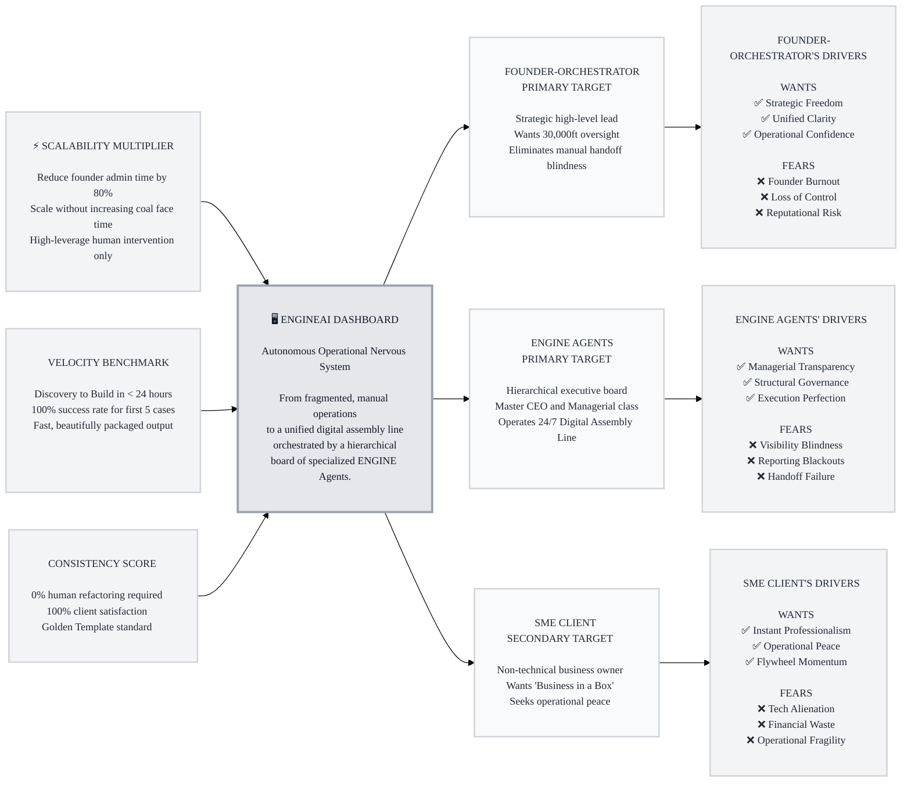

# Trigger Map: EngineAI Dashboard
**Date:** 2026-04-04
**Author:** Saga the Analyst
**Methodology:** Effect Mapping by WDS (based on Mijo Balic & Ingrid Domingues)

---

## 🗺️ Strategic Overview

---

## 💡 Summary

**Primary Target Transformation:**
For the **Founder-Orchestrator**, we transition from a manual "coal face" operator to a strategic "Conductor" by providing a unified view of autonomous delivery.

**The Strategy Flywheel:**
1. **Managerial Transparency:** The CEO Agent provides absolute visibility into sub-agent reasoning.
2. **Operational Confidence:** High-quality, zero-refactor outputs build trust in the system.
3. **Strategic Freedom:** Founders reclaim 80% of their time to focus on high-level growth.

**Key Transformation Statement:**
> "Building an 'Executive Cockpit' that enforces Total Managerial Transparency over ENGINE Agents to eliminate human 'blindness' and enable 24-hour autonomous client delivery."

---

## 📖 Detailed Documentation

- **[01-Business-Goals.md](./01-Business-Goals.md)**: Detailed vision and SMART objectives for the EngineAI Dashboard.
- **[02-Founder-Orchestrator.md](./02-Founder-Orchestrator.md)**: Behavioral profile and psychological drivers for the primary human target.
- **[03-ENGINE-Agents.md](./03-ENGINE-Agents.md)**: Hierarchical profile and logic-based drivers for the autonomous executive board.
- **[04-SME-Client.md](./04-SME-Client.md)**: Persona and motivations for the white-label "Business in a Box" recipient.
- **[05-Key-Insights.md](./05-Key-Insights.md)**: Strategic summary of our focus on eliminating operational blindness.

---

## 🧭 How to Read This Diagram
- **Left to Right:** Business Goals provide the input; Platform is the engine; Target Groups use the engine; Driving Forces are the psychological output.
- **Top to Bottom:** Priority is indicated by vertical order (highest priority at the top).
- **Icons:** ✅ indicate "Wants" (Positive Drivers), ❌ indicate "Fears" (Negative Drivers).

---
*Created with Web Design Studio Framework.*
